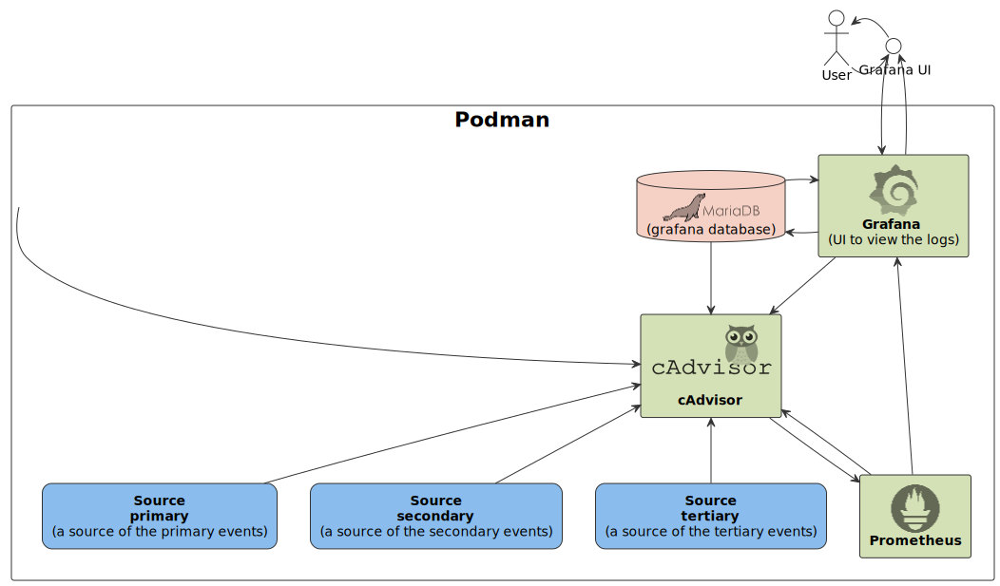

# cAdvisor Sandbox

This repository contains a basic **cAdvisor** configuration example.

**cAdvisor** (Container Advisor) provides container users an understanding of the resource usage and 
performance characteristics of their running containers.

More detailed documentation of the **[cAdvisor](https://github.com/google/cadvisor)**.

To run this example **Podman** installation is required.

## Diagram

## Instructions

- Run `make up` to start up this example (run `make` to see full list of options).
- Observe metrics on the **Grafana** dashboard.
